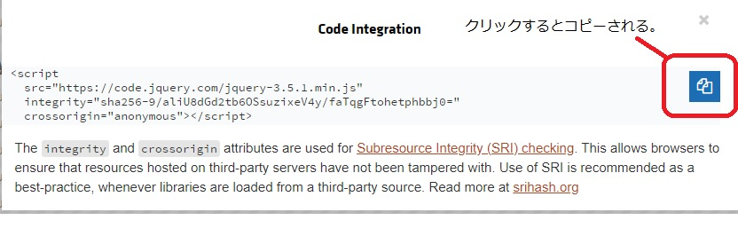

# jQueryメモ
## 参照web
1. [Web Design Leaves](https://www.webdesignleaves.com/pr/jquery/introduction.html) :    
jQueryライブラリの読み込み方法、HTML上での位置等の情報がわかりやすい。1.x, 2.x, 3.x系での違いもありその説明もわかりやすい。

## メモ　[1]
### 〇　CDN 経由で読み込む方法
jQuery の[ダウンロードのページ](https://code.jquery.com/jquery/)で使いたいバージョンのリンク（uncompressed, minified）をクリックして、表示されるリンクをコピーして \</body> の直前で読み込みます。

通常は圧縮されたファイル（minified と記載されているファイルで拡張子が min.js となっている）ものを使用します。


CDNから`<script>...</script>`をコピーする様子



コピーした`<script>...</script>`は`</body>`タグの直前に入れる。

```HTML
<!DOCTYPE html>
<html lang="en">
<head>
    <meta charset="UTF-8">
    <meta name="viewport" content="width=device-width, initial-scale=1.0">
    <title>DjQueryの勉強</title>
</head>
<body>

<!-- 
</body>の直前にCNDからコピーした<script>....</script>を挿入する。
 -->
    <script src="https://code.jquery.com/jquery-3.5.1.min.js" integrity="sha256-9/aliU8dGd2tb6OSsuzixeV4y/faTqgFtohetphbbj0=" crossorigin="anonymous"></script>    
</body>
</html>
```